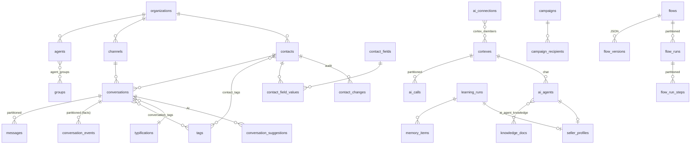
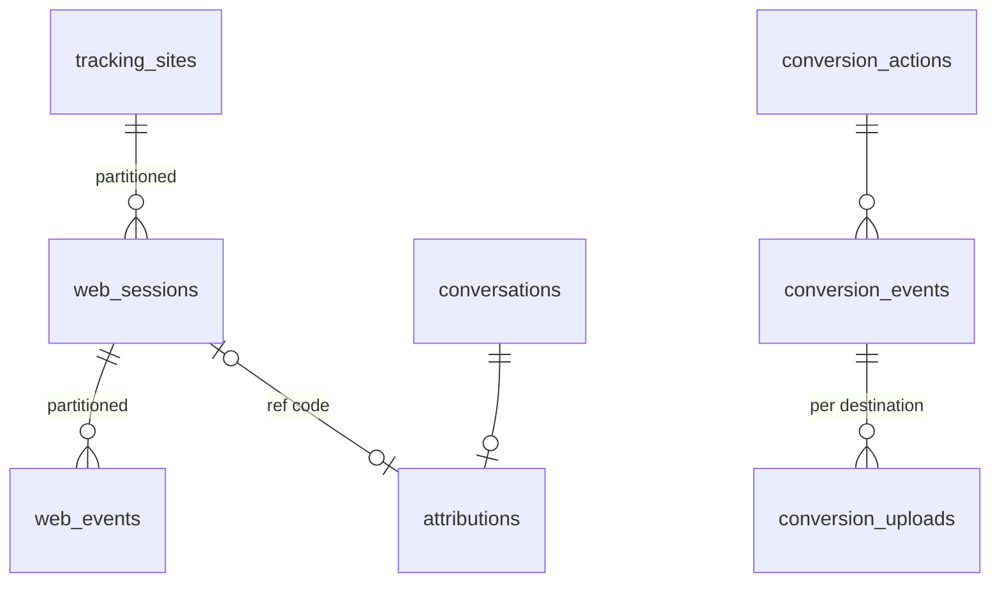
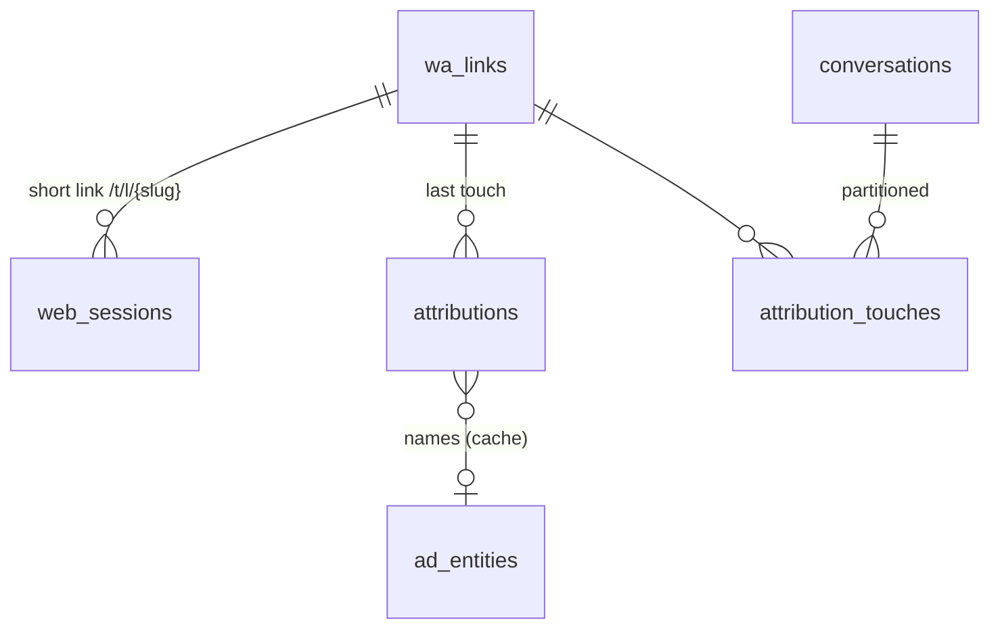

# Data model: WA Agent Platform (Supabase / Postgres 15+)

> **Team rule:** every feature that is created or changed starts here. First the model is designed
> (tables, keys, constraints, indexes, realtime, reporting, RLS, retention), then the migration
> in `supabase/migrations/`, and only after that the service and UI code.

## 1. Principles

| Decision | Choice | Why |
|---|---|---|
| Engine | Postgres on Supabase | Realtime, Auth, Storage, Vault, pg_cron and RLS in one place |
| Tenancy | `organization_id` on every business table + RLS | Ready for several companies (resale) with no redesign; today there is one org |
| Keys | `bigint generated by default as identity` | Compact and fast in indexes and joins at high volume; contracts with the API stay as integers |
| Time | Always `timestamptz` in UTC; the org's time zone only at presentation and rollup time | No ambiguity in reports |
| Enumerations | `text` + `CHECK` for fixed sets (status, direction); **tables** for what the client configures (tipificaciones, tags, groups) | CHECK is easy to evolve; configurable catalogs need FKs and reporting by id |
| Flexible attributes | Typed EAV (`contact_field_values`) for client fields; `jsonb` for configuration and AI payloads | Filtering and aggregating by value (e.g. budget > X) needs typed columns with indexes |
| High-volume tables | **Monthly range partitioning** (`messages`, `conversation_events`, `ai_calls`, `flow_runs`, `flow_run_steps`, `webhook_deliveries`, `inbound_events`) | Indexes per partition, retention by `DROP PARTITION`, efficient scans by date |
| Reporting | Facts (`conversation_events`) → **incremental daily rollups** in the `reporting` schema, refreshed with pg_cron | Dashboards read small tables; operational load doesn't compete with reporting |
| Real time | **Realtime Broadcast from the database** (triggers → `realtime.broadcast_changes`) on private per-org channels | Scales better than Postgres Changes; RLS on `realtime.messages` |
| Secrets | Supabase **Vault** (`*_secret_id uuid`); never in plain text in tables | Provider keys, WhatsApp tokens, webhook secrets |
| Audit | Append-only tables (`contact_changes`, `conversation_events`, `config_revisions`) | Who changed what, and whether it was a person, the AI or an automation |
| Writes | The backend (service role) writes; the frontend reads with RLS and listens over Realtime | A single place with business rules |

## 2. Domains and tables

### Identity and organization
- `organizations`: tenant; time zone and plan.
- `agents`: advisors/administrators. `auth_user_id` links to `auth.users` (Supabase Auth). Roles `admin | supervisor | agent`.
- `groups` + `agent_groups`: teams. `groups.description` is also the AI's **routing criterion**.
- `org_settings (organization_id, key) → jsonb`: module configuration (company, conversations, classifier, appointments…). Each change leaves a `config_revisions` record.

### Channels and contacts
- `channels`: WhatsApp numbers (`phone_number_id`, `waba_id`, token in Vault, default AI agent).
- `contacts`: one per `(organization_id, wa_id)`. Stage, opt-out, blocking, **client memory** (`memory`) shared by every agent.
- `contact_fields` + `contact_field_values` (typed EAV: `value_text | value_number | value_date | value_bool`, exactly one per row by `CHECK`), `source` (agent/ai/import/api) and who edited it.
- `contact_changes`: append-only history (native fields, custom fields and memory). The AI never overwrites a field whose last change came from a person.
- `tags` (scope conversation/contact/both, `ai_description` = criterion for the AI) + `contact_tags`.

### Conversations
- `conversations`: current state (operational snapshot) + denormalizations for SLA and lists:
  `handoff_at`, `first_response_at`, `closed_at`, `message_count`, `inbound_count`, `last_*`, ad origin (Click to WA), AI summary and sentiment.
- `messages` (**partitioned by month**, PK `(id, created_at)`): every message, WhatsApp status, Meta billing data.
- `message_wa_ids`: idempotency and lookup by `wa_message_id` (Meta retries webhooks and statuses arrive later).
- `conversation_tags` (source agent/ai/rule + confidence), `typifications` (with `is_success` = counts as a sale).
- `conversation_suggestions`: each AI suggestion is a row (pending/accepted/dismissed/expired) → **acceptance rate** per type.
- `conversation_events` (**partitioned**, append-only): the **fact table** for reporting: `created, message_in, bot_reply, handoff, assigned, transferred, first_agent_response, tagged, typified, classified, closed, reopened, flow_started…`

### AI (Cortex)
- `ai_connections`: a connection to an LLM (provider `anthropic | openai | openai_compatible | azure_openai`, model, base URL, key in Vault, timeout, costs per MTok).
- `cortexes` + `cortex_members`: **routing policy with failover** over several connections (strategy `failover | lowest_latency | weighted`, latency budget, attempts, circuit breaker, validation rules for out-of-range responses).
- `ai_connection_health`: circuit breaker state and rolling latencies per connection.
- `ai_calls` (**partitioned**): each call: cortex, connection, purpose, attempt, result (`ok | error | timeout | slow | invalid | refused`), latency, tokens, cost, and which call it came from when it was a fallback.
- `ai_agents`: chat agents (formerly `bots`): Cortex, prompt, connected resources (`use_knowledge`, `use_memory`, `use_customer_memory`, `use_catalog`, `use_appointments`).
- `knowledge_docs` + `ai_agent_knowledge`: documents shared between agents.
- `memory_items`: business memory learned from conversations (`pending → approved/rejected`), with evidence (`evidence_conversation_ids bigint[]`).
- `learning_runs`: "generate memory" and "best salesperson" jobs.
- `seller_profiles`: playbook (`jsonb`) + prompt learned from the best advisors; links to the `ai_agent` created from it.

### Catalog
- `products`: unique `(organization_id, sku)` (= `retailer_id` in Meta), price `numeric(14,2)`, flexible attributes `jsonb`, **full-text search in Spanish** (`search tsvector` generated + GIN) and trigram on the name.
- `catalog_sync_runs`: imports (CSV/Excel), Meta and external feed, with results.

### Campaigns and templates
- `wa_templates`: synchronized copy of Meta's templates (status, quality, components).
- `campaigns` (audience in `jsonb`, scheduling) + `campaign_recipients` (status by timestamps `sent_at/delivered_at/read_at/failed_at`, Meta error code).

### Automations and flows (Scratch/n8n)
- `automations`: simple rules (welcome message, keywords, business hours, inactivity).
- `flows` (trigger + status + mode `junior | advanced`) and `flow_versions` (**versioned JSON definition**, schema version, `created_by_ai` + `ai_prompt` when the AI edited it).
- `flow_runs` (**partitioned**; `waiting` + `resume_at` for waits) and `flow_run_steps` (**partitioned**; input/output per block, like n8n "executions").
- `config_revisions`: JSON version history for any editable entity (agents, Cortex, automations, settings), with the human or AI source and the prompt used.

### Operations
- `followups`, `appointments` (end = `starts_at + duration_min`; capacity validated in the service).
- `quick_replies`, `resources` (file in Supabase Storage: `storage_path`).
- `integrations`, `outbound_webhooks` (signing secret in Vault) + `webhook_deliveries` (**partitioned**).
- `inbound_events` (**partitioned**, 30 days): raw Meta payloads, for reprocessing and auditing.
- `alerts` (Centro de Control).

## 3. Real time

| Topic | Event | Who listens |
|---|---|---|
| `org:{org_id}:inbox` | INSERT/UPDATE on `conversations` | Inbox, Tablero |
| `org:{org_id}:conversation:{id}` | INSERT/UPDATE on `messages` | Open chat |
| `org:{org_id}:alerts` | INSERT on `alerts` | Centro de Control |

Triggers call `realtime.broadcast_changes(...)` (private channels). The `realtime.messages` policy only
lets authenticated agents of the same organization subscribe. This removes the limit of the
current in-memory hub (one backend replica).

## 4. Reporting

- Fact sources: `conversation_events`, `messages`, `ai_calls`, `campaign_recipients`.
- **Daily rollups** in `reporting.*` (by org and day, in the org's time zone):
  `daily_conversations`, `daily_agents`, `daily_groups`, `daily_typifications`, `daily_tags`,
  `hourly_messages`, `daily_ai`, `daily_billing`, `daily_campaigns`.
- **Flow analytics** (migration 15): `daily_flows` (runs by start day: started/succeeded/failed/cancelled/waiting,
  duration), `daily_flow_blocks` (per block: distinct runs that reached it, executions, errors, waits, `exits` =
  failed/cancelled runs whose last step was the block, `stuck` = runs still waiting there, latency p50/p95) and
  `daily_flow_choices` (option chosen in `switch_reply` / `ai_decide`, from `flow_run_steps.output->>'choice'`).
  `flow_run_steps` carries `organization_id` and `flow_id` (denormalized, filled by the engine; a trigger covers other
  writers) so the rollup groups millions of steps without joining `flow_runs` across partitions.
  `refresh_range` = `refresh_core` (the original rollups) + `refresh_flows`.
- `reporting.refresh_range(org, from, to)` is **idempotent** (delete+insert of the range); pg_cron runs it every
  10 minutes for today and yesterday, and it can be launched by hand for backfills.
- Reports read rollups (milliseconds) instead of scanning months of messages.
- "Real time" and "Tablero" read the current state from `conversations` (partial indexes for open conversations).

## 5. Indexes (criteria)

- Every list: `(organization_id, <filter>, <order> desc)`; **partial** indexes for hot states
  (`status <> 'closed'`, `status = 'human' and assigned_agent_id is null`, `done_at is null`, `status = 'pending'`).
- Searches: trigram (`gin_trgm_ops`) on contact names; `tsvector` on products.
- `jsonb`: `jsonb_path_ops` only where it is filtered (product attributes).
- Partitions: BRIN on `created_at` for long reporting scans.

## 6. Retention

| Table | Retention | Mechanism |
|---|---|---|
| `messages`, `conversation_events` | indefinite (business) | monthly partitions; can be archived to cold storage |
| `ai_calls`, `flow_run_steps`, `webhook_deliveries` | 6 months | `DROP PARTITION` (pg_cron) |
| `inbound_events` | 30 days | `DROP PARTITION` |

Partitions are created ahead of time with `public.ensure_monthly_partitions()` (pg_cron, monthly) and each
table has a `DEFAULT` partition so no insert is lost.

## 7. Security (RLS)

- RLS **enabled on every table**. `authenticated` reads only its organization (`public.current_org_id()`).
- Sensitive configuration (`ai_connections`, `outbound_webhooks`, `integrations`, `org_settings`) only for `admin`.
- Writes: backend with the service role (which bypasses RLS). The frontend does not write directly.
- Secrets in Vault; tables keep only the `uuid` of the secret.

## 8. Migrations

`supabase/migrations/` (Supabase CLI format). Order:
1. `..._01_core.sql`: extensions, utilities, organizations, agents, groups, settings, audit.
2. `..._02_contacts.sql`
3. `..._03_conversations.sql`: conversations, partitioned messages, events, tags, tipificaciones, suggestions.
4. `..._04_ai.sql`: connections, Cortex, AI calls, agents, knowledge, memory, learning, salesperson.
5. `..._05_catalog_campaigns.sql`
6. `..._06_automation_flows.sql`
7. `..._07_operations.sql`: follow-ups, appointments, resources, integrations, webhooks, alerts, raw events.
8. `..._08_reporting.sql`: `reporting` schema, rollups and refresh functions.
9. `..._09_supabase.sql`: Realtime (broadcast), RLS, Vault and pg_cron. **Guarded**: only runs if the Supabase schemas exist, so the same migrations are tested on a local Postgres.

`supabase/seed.sql` creates the initial organization.

## 10. Phase 2: attribution, CRM, voice and multi-company SaaS

### 10.1 Attribution and conversions (Click to WA Google, web traffic, Google Ads / Meta CAPI)

- `tracking_sites`: site with its public key (`public_key`) for the script/GTM, allowed domains and channel.
- `web_sessions` (**partitioned**): visit with `ref_code` (short code that travels in the wa.me prefilled text),
  UTMs, `gclid/gbraid/wbraid`, `fbclid/fbc/fbp`, `ttclid`, `msclkid`, GA `client_id`, landing page and
  referrer, hashed IP (privacy). `wa_click_at` and `matched_conversation_id` close the loop.
- `web_events` (**partitioned**): `page_view`, `wa_click`, `custom` → "Web traffic" report.
- `attributions`: one per conversation (last touch): channel `meta_ctwa | google_ads | meta_ads_web | paid_other |
  organic_web | campaign | direct`, the matched session and the click identifiers (`gclid`, `ctwa_clid`, `fbc`).
- `conversion_actions`: what counts as a conversion (`typification` with `is_success`, change to stage
  `client`, `appointment_booked`, `deal_won`) and where it goes (Google Ads conversion action, Meta CAPI
  dataset/pixel) with value and currency.
- `conversion_events`: each conversion that happened, with an attribution snapshot and hashed user data
  (SHA-256 of email/phone, normalized) for Enhanced Conversions / CAPI.
- `conversion_uploads`: delivery outbox per destination with retries (`pending → sent | failed | skipped`).

### 10.2 CRM (HubSpot and Salesforce)

- `deals`: local deal (contact, conversation, amount, currency, stage, `open | won | lost`, owner). It feeds
  CRM syncing, conversions (`deal_won`) and the "best salesperson" ranking by **amount**.
- `integration_connections`: an account connected per provider (`hubspot | salesforce | google_ads | meta`),
  OAuth tokens in Vault (`access/refresh_token_secret_id`), `expires_at`, `external_account_id` (portal id,
  instance URL, customer id), scopes and status. (The old `integrations` table stays as the
  Centro de Control catalog.)
- `integration_mappings`: field ⇄ property mapping per object (`contact`, `deal`) and direction
  (`push | pull | both`), with optional transformation.
- `external_links`: local entity ⇄ remote id (`contact ⇄ HubSpot contact`, `deal ⇄ Salesforce Opportunity`),
  with `remote_updated_at` and `sync_hash` to avoid loops in two-way syncing.
- `integration_outbox` (**partitioned**): changes to push (upsert contact/deal, conversation note) with
  retries and exponential backoff; it is filled by the backend and by triggers.
- Webhooks from HubSpot/Salesforce enter through `inbound_events` (new `source` values).

### 10.3 Voice: WhatsApp Business Calling API

- `voice_agents`: voice agent (uses an `ai_agent` for prompt/knowledge/memory, plus voice: provider,
  voice, language, greeting, maximum duration, transfer rules, business hours).
- `calls`: each call (`wa_call_id` unique, direction, status `ringing → connected → ended | missed |
  rejected | failed`, handled by `voice_agent` or `agent`, times, duration, end reason, recording
  in Storage, transcript, AI summary, and the conversation it belongs to).
- `call_events` (**partitioned**): Meta webhooks and internal events (SDP, pre-accept, transfer...).
- `call_turns`: conversational turns (speaker, text, offsets in ms) to read the transcript.
- `channels.calling_enabled` + `calling_hours`. New `conversation_events` events: `call_started`,
  `call_ended`. New message type `call` (a summary card in the chat).

### 10.4 Multi-company SaaS

- `plans`: Team / Professional / Enterprise with `limits` (channels, users, monthly conversations, AI agents,
  flows, voice minutes, campaign recipients, AI tokens) and `features` (flows, voice, crm, attribution, api).
- `organizations` + `status` (`trial | active | past_due | suspended | cancelled`), `plan_id`, `trial_ends_at`,
  `country`, `billing_email`.
- `subscriptions`: one per organization with a payment provider (`stripe`), external id, status and period.
- `billing_events`: payment provider webhooks (idempotent by `provider_event_id`).
- `usage_counters`: monthly consumption per metric (`conversations`, `messages_out`, `ai_cost_usd`,
  `voice_minutes`, `campaign_recipients`), maintained by **triggers** on `conversations`, `messages`,
  `ai_calls`, `calls` and `campaign_recipients`. `check_limit()` in SQL decides whether something can be created.
- `platform_admins`: back office for the SaaS owner (organizations, plans, consumption, suspensions).
- Users in several companies: `agents` is a per-organization membership; login chooses the organization when the
  email belongs to more than one. `agents.auth_user_id` is unique **per organization**.
- Webhooks: the organization is resolved by `channels.phone_number_id` (never by configuration).
- Onboarding: Meta **Embedded Signup** connects each customer's WhatsApp number (token in Vault).

### 10.5 Trigger messages and multi-touch attribution (migration 16)

- `wa_links` (**trigger message**): the prefilled WhatsApp text (`trigger_text`, normalized as `trigger_key`:
  lowercase, no accents/punctuation, no ref code), platform (`meta_ads | google_ads | web | social | email | qr | sms |
  other`), UTMs (defaults per platform), Meta ad ids and Google campaign ids that use it, and arrival actions
  (`tags`, `group_id`, `flow_id`). A unique partial index makes an active text identify exactly one link.
  Published as a short link `/t/l/{slug}` (records the visit + click with the URL's UTMs/gclid/fbclid and appends
  `(ref: CODE)`) or as a direct `wa.me` link (CTWA ads, printed material).
- Matching on **every** inbound message: CTWA referral (link by `meta_ad_ids`, else by text) → ref code (visit; the
  link fills missing UTMs) → trigger text (customer deleted the code) → first message only: template campaign →
  direct. Text shorter than 8 normalized characters never matches.
- `attributions` stays one row per conversation = **last touch** (what conversion uploads use). New columns:
  `link_id`, enriched names (`platform_campaign_id/name`, `ad_group_id/name`, `ad_name`, `keyword`),
  `enrichment_status`, `touches`, `first_touch_id`, `last_touch_at`. New channel `offline` (QR/SMS); new
  `matched_by` value `trigger_text`.
- `attribution_touches` (**partitioned** monthly, 24 months): each signal (first touch + returns through another
  ad/link); an identical consecutive signal is not repeated. Enables first-touch vs last-touch analysis.
- `ad_entities`: cache of Meta ad → ad set → campaign names and Google Ads gclid → campaign / ad group / keyword
  (`click_view`), so enrichment does not call the APIs once per conversation.
- `web_sessions.site_id` is now nullable and `web_sessions.link_id` records sessions created by a short link.
- `reporting.daily_links`: clicks, conversations (last touch), first touches, returns, conversions and value per
  link and day; `refresh_range` = core + flows + links.
- Flows: new trigger block `wa_link` ("Cuando llega por un mensaje disparador", optional list of link slugs/names);
  `wa_links.flow_id` starts that flow directly.

## 12. Phase 4: scale, omnichannel, AI quality, public API

### 12.1 Scale and production (migration 17)

- **Live events across replicas:** each backend replica keeps its WebSockets; events are published with Postgres
  `NOTIFY wa_events` (payload ≤ ~7.5 KB: `{org, event, data}`) and every replica `LISTEN`s and forwards to its own
  sockets of that organization. Larger payloads go to `realtime_spill` (UNLOGGED, purged after 10 min) and the
  notification carries only its id. LISTEN needs a session connection (Supabase **Session pooler**, not the
  transaction pooler).
- **Workers:** `ROLE=api|worker|all`. Background loops run only in `worker`/`all`; each loop holds a Postgres
  advisory lock, so N worker replicas run each loop once. `worker_heartbeats` (one row per process: role, version,
  per-loop last success/error) feeds `/health/ready` and the back-office.
- **Rate limits:** `rate_limit_counters` (UNLOGGED, fixed windows) + `rate_limit_hit(bucket, window_s)` shared by
  all replicas (public API keys, `/t/*` tracking, web chat).
- `ops_cleanup()` every 10 minutes (pg_cron).

### 12.2 Omnichannel: Instagram DM, Messenger, web chat (migration 18)

- `channels.provider`: `whatsapp_cloud | messenger | instagram | webchat`; `phone_number_id` only required for
  WhatsApp; `external_id` (page id, IG professional account id, widget key) unique per provider; `page_id`
  (Messenger and Instagram send with the Page token), `settings` (web chat look, greeting, allowed domains),
  `status`/`last_error`.
- `contacts.wa_id` is now nullable; **`contact_identities`** is the entry key per channel (`wa_id`, PSID, IGSID,
  web-chat visitor id), with `username`, `profile` and `last_inbound_at` (24 h window per channel). WhatsApp ids
  are unique per organization, the others per channel (page-scoped). Existing contacts got their WhatsApp identity.
- `messages.wa_message_id` / `message_wa_ids` hold the **provider message id** of any channel (Meta `mid`,
  web-chat uuid); the name is historical.
- `webchat_sessions`: widget visitor (token hash, page, contact, conversation, tracking `ref_code` for attribution).
- `attributions.channel` adds `instagram`, `messenger`, `webchat`.
- `reporting.daily_channels`: conversations, inbound/outbound messages and new contacts per channel and day.
- Plan feature `omnichannel` (Profesional and Enterprise).
- `inbound_events.source` also accepts `messenger` and `instagram` (migration `20261011000500`).

### 12.3 AI quality and coaching (migration 19)

- `qa_scorecards`: rubric (`criteria`: key, label, description, weight, critical), who it applies to
  (`agent | bot | any`), auto review on close with sampling, minimum messages and groups.
- `conversation_reviews`: one AI review per conversation and scorecard (unique) plus any human reviews: per-criterion
  scores with evidence, weighted `total_score`, `critical_failed`, sentiment (+score), customer effort (1–5),
  summary, `ai_call_id`; `disputed` when the advisor contests it. Updates `conversations.qa_score` and
  `conversations.ai_sentiment` (`mixed` → `neutral`).
- `coaching_items`: actionable suggestions per advisor (from reviews), with status.
- `agent_test_suites` / `agent_test_cases` (input turns + expectations: must/must-not include, handoff, tool,
  rubric for an LLM judge) / `agent_test_runs` (pass %, cost, the `config_revisions` row tested) /
  `agent_test_results`. Suites can run on every change of the AI agent.
- `reporting.daily_qa`: reviews, score sum, critical failures and sentiment per advisor (0 = bot) and day.
- Plan feature `qa` (Profesional and Enterprise).
- AI purposes `qa` (reviews) and `agent_test` (agent tests and their LLM judge) in `ai_calls` and `cortexes` (migration `20261011000600_quality_purposes`), so their cost and health are reported separately and they can have their own Cortex.

### 12.4 Public API, connectors and advisor app (migration 20)

- `api_keys`: only the SHA-256 is stored; visible `prefix`; `scopes`; per-key rate limit; expiry/revocation.
- `api_requests` (**partitioned**, ~1 month): method, templated path, status, latency, key → audit and
  `reporting.daily_api` (requests, errors, 429s, p95).
- `api_idempotency`: `Idempotency-Key` on POST, 24 h.
- `outbound_webhooks.source` (`panel | api | zapier | make | n8n`) + `api_key_id`: REST Hooks subscriptions of
  connectors are ordinary outbound webhooks (deleted with their key).
- `push_subscriptions`: Web Push (VAPID) of the installable advisor app with per-agent preferences.
- `refresh_range` = core + flows + links + channels + qa + api.
- Migration 20b (`20261011000700_api_sources`): origin `api` for `conversation_events.actor_type`, `deals.source`
  and `contact_tags.source` (`contact_changes`/`contact_field_values` already accepted it). Guide: `docs/api.md`.

## 11. Feature log (data-model changes)

| Date | Feature | Model change |
|---|---|---|
| 2026-10-06 | Initial model for Supabase | Everything above. Replaces the SQLite-oriented model (tags as `",a,b,"` strings, tipificaciones in JSON, unpartitioned messages, reports computed in Python). |
| 2026-10-06 | AI classification + client fields | `tags`, `conversation_tags`, `typifications`, `conversation_suggestions`, `contact_fields`, `contact_field_values`, `contact_changes`, `conversations.ai_*` |
| 2026-10-06 | Memory, best salesperson, catalog | `memory_items`, `learning_runs`, `seller_profiles`, `contacts.memory`, `products`, `catalog_sync_runs`, `ai_agents.use_*` |
| 2026-10-06 | Cortex with failover + JSON editable with AI | `ai_connections`, `cortexes`, `cortex_members`, `ai_connection_health`, `ai_calls`, `config_revisions` |
| 2026-10-06 | Flows (Scratch Jr / Scratch 3) | `flows`, `flow_versions`, `flow_runs`, `flow_run_steps` |
| 2026-10-07 | Backend moved onto the Supabase model | The ORM mirrors the migrations (`test_schema`); 37 tests on real Postgres; storage in Supabase Storage; secrets in Vault |
| 2026-10-07 | Flow engine | No schema changes: uses `flows`, `flow_versions`, `flow_runs` (`context` = variables + resumable execution stack), `flow_run_steps`. Shared block catalog `blocks.json` |
| 2026-10-08 | Phase 2 (model) | Attribution, CRM, voice and SaaS: migrations 11–14 (section 10) |
| 2026-10-11 | Public API `/v1` + advisor PWA | Migration 20b: origin `api` (actor and sources) |
| 2026-10-11 | Phase 4 model: scale, omnichannel, AI quality, public API | Migrations 17–20 (§12): `worker_heartbeats`, `realtime_spill`, `rate_limit_counters`; `contact_identities`, `webchat_sessions`, channel providers, `contacts.wa_id` nullable; `qa_scorecards`, `conversation_reviews`, `coaching_items`, `agent_test_*`; `api_keys`, `api_requests` (partitioned), `api_idempotency`, `push_subscriptions`; rollups `daily_channels`, `daily_qa`, `daily_api` |
| 2026-10-10 | Trigger messages + multi-touch attribution + ad/CRM alignment | Migration 16 (§10.5): `wa_links`, `attribution_touches` (partitioned), `ad_entities`, `reporting.daily_links`; `attributions` +link/enriched names/touches; `web_sessions.link_id`, `site_id` nullable; channel `offline` |
| 2026-10-09 | Reportes → Análisis de flujos | Migration 15: `flow_run_steps.organization_id/flow_id` (+ index, RLS `org_read`), `reporting.daily_flows`, `daily_flow_blocks`, `daily_flow_choices`, `reporting.refresh_flows`; `refresh_range` now wraps `refresh_core` + `refresh_flows` |
| 2026-10-09 | Centro de Control → Integraciones | No schema change: the card reads `integration_connections` (phase 2) instead of the legacy `integrations` table |
| 2026-10-07 | Security hardening (Supabase advisors) | Fixed `search_path` on functions; `pg_trgm`/`citext` → `extensions` schema; RLS helpers and Realtime triggers → `private` schema (not exposed through `/rest/v1/rpc`) |
