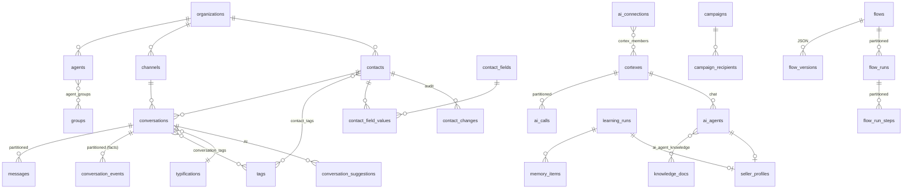
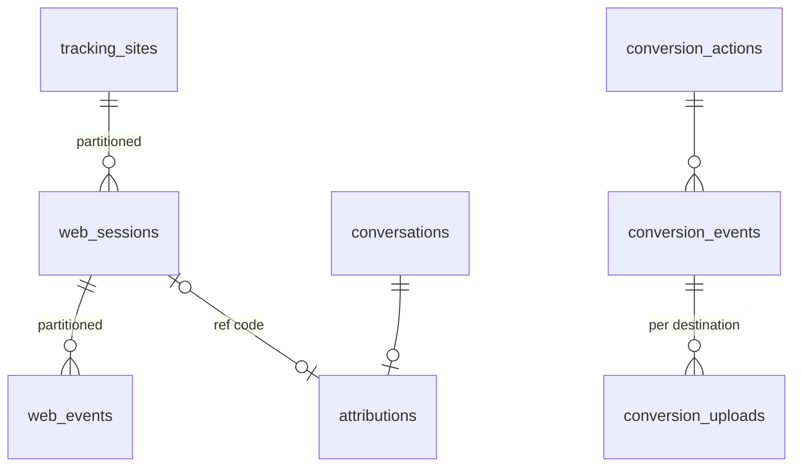
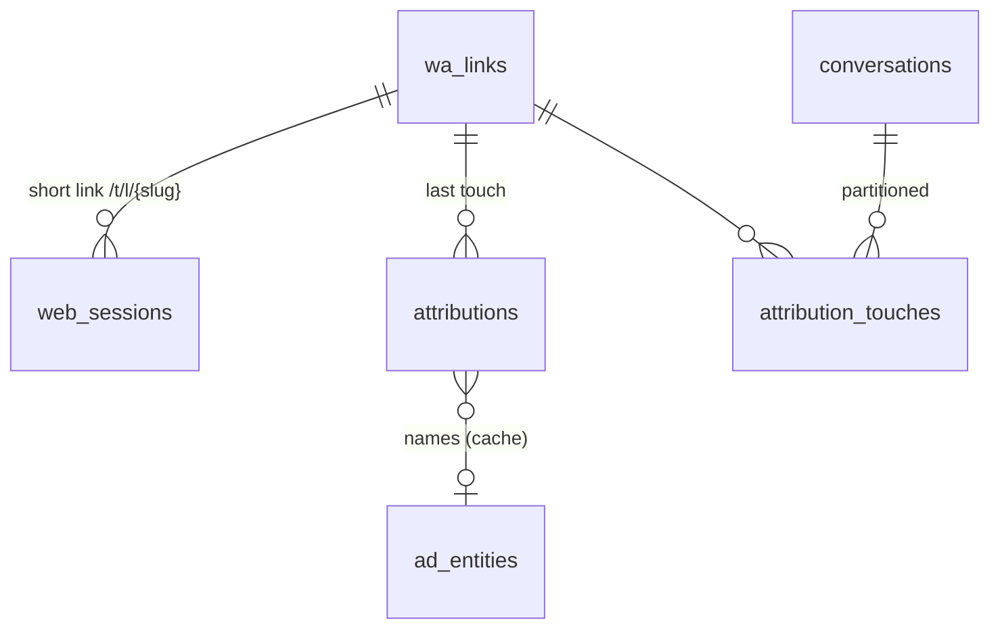

# Data model: WA Agent Platform (Supabase / Postgres 15+)

> **Team rule:** every feature that is created or changed starts here. First the model is designed
> (tables, keys, constraints, indexes, realtime, reporting, RLS, retention), then the migration
> in `supabase/migrations/`, and only after that the service and UI code.

## 1. Principles

| Decision | Choice | Why |
|---|---|---|
| Engine | Postgres on Supabase | Realtime, Auth, Storage, Vault, pg_cron and RLS in one place |
| Tenancy | `organization_id` on every business table + RLS | Ready for several companies (resale) with no redesign; today there is one org |
| Keys | `bigint generated by default as identity` | Compact and fast in indexes and joins at high volume; contracts with the API stay as integers |
| Time | Always `timestamptz` in UTC; the org's time zone only at presentation and rollup time | No ambiguity in reports |
| Enumerations | `text` + `CHECK` for fixed sets (status, direction); **tables** for what the client configures (tipificaciones, tags, groups) | CHECK is easy to evolve; configurable catalogs need FKs and reporting by id |
| Flexible attributes | Typed EAV (`contact_field_values`) for client fields; `jsonb` for configuration and AI payloads | Filtering and aggregating by value (e.g. budget > X) needs typed columns with indexes |
| High-volume tables | **Monthly range partitioning** (`messages`, `conversation_events`, `ai_calls`, `flow_runs`, `flow_run_steps`, `webhook_deliveries`, `inbound_events`) | Indexes per partition, retention by `DROP PARTITION`, efficient scans by date |
| Reporting | Facts (`conversation_events`) → **incremental daily rollups** in the `reporting` schema, refreshed with pg_cron | Dashboards read small tables; operational load doesn't compete with reporting |
| Real time | **Realtime Broadcast from the database** (triggers → `realtime.broadcast_changes`) on private per-org channels | Scales better than Postgres Changes; RLS on `realtime.messages` |
| Secrets | Supabase **Vault** (`*_secret_id uuid`); never in plain text in tables | Provider keys, WhatsApp tokens, webhook secrets |
| Audit | Append-only tables (`contact_changes`, `conversation_events`, `config_revisions`) | Who changed what, and whether it was a person, the AI or an automation |
| Writes | The backend (service role) writes; the frontend reads with RLS and listens over Realtime | A single place with business rules |

## 2. Domains and tables

### Identity and organization
- `organizations`: tenant; time zone and plan.
- `agents`: advisors/administrators. `auth_user_id` links to `auth.users` (Supabase Auth). Roles `admin | supervisor | agent`.
- `groups` + `agent_groups`: teams. `groups.description` is also the AI's **routing criterion**.
- `org_settings (organization_id, key) → jsonb`: module configuration (company, conversations, classifier, appointments…). Each change leaves a `config_revisions` record.

### Channels and contacts
- `channels`: WhatsApp numbers (`phone_number_id`, `waba_id`, token in Vault, default AI agent).
- `contacts`: one per `(organization_id, wa_id)`. Stage, opt-out, blocking, **client memory** (`memory`) shared by every agent.
- `contact_fields` + `contact_field_values` (typed EAV: `value_text | value_number | value_date | value_bool`, exactly one per row by `CHECK`), `source` (agent/ai/import/api) and who edited it.
- `contact_changes`: append-only history (native fields, custom fields and memory). The AI never overwrites a field whose last change came from a person.
- `tags` (scope conversation/contact/both, `ai_description` = criterion for the AI) + `contact_tags`.

### Conversations
- `conversations`: current state (operational snapshot) + denormalizations for SLA and lists:
  `handoff_at`, `first_response_at`, `closed_at`, `message_count`, `inbound_count`, `last_*`, ad origin (Click to WA), AI summary and sentiment.
- `messages` (**partitioned by month**, PK `(id, created_at)`): every message, WhatsApp status, Meta billing data.
- `message_wa_ids`: idempotency and lookup by `wa_message_id` (Meta retries webhooks and statuses arrive later).
- `conversation_tags` (source agent/ai/rule + confidence), `typifications` (with `is_success` = counts as a sale).
- `conversation_suggestions`: each AI suggestion is a row (pending/accepted/dismissed/expired) → **acceptance rate** per type.
- `conversation_events` (**partitioned**, append-only): the **fact table** for reporting: `created, message_in, bot_reply, handoff, assigned, transferred, first_agent_response, tagged, typified, classified, closed, reopened, flow_started…`

### AI (Cortex)
- `ai_connections`: a connection to an LLM (provider `anthropic | openai | openai_compatible | azure_openai`, model, base URL, key in Vault, timeout, costs per MTok).
- `cortexes` + `cortex_members`: **routing policy with failover** over several connections (strategy `failover | lowest_latency | weighted`, latency budget, attempts, circuit breaker, validation rules for out-of-range responses).
- `ai_connection_health`: circuit breaker state and rolling latencies per connection.
- `ai_calls` (**partitioned**): each call: cortex, connection, purpose, attempt, result (`ok | error | timeout | slow | invalid | refused`), latency, tokens, cost, and which call it came from when it was a fallback.
- `ai_agents`: chat agents (formerly `bots`): Cortex, prompt, connected resources (`use_knowledge`, `use_memory`, `use_customer_memory`, `use_catalog`, `use_appointments`).
- `knowledge_docs` + `ai_agent_knowledge`: documents shared between agents.
- `memory_items`: business memory learned from conversations (`pending → approved/rejected`), with evidence (`evidence_conversation_ids bigint[]`).
- `learning_runs`: "generate memory" and "best salesperson" jobs.
- `seller_profiles`: playbook (`jsonb`) + prompt learned from the best advisors; links to the `ai_agent` created from it.

### Catalog
- `products`: unique `(organization_id, sku)` (= `retailer_id` in Meta), price `numeric(14,2)`, flexible attributes `jsonb`, **full-text search in Spanish** (`search tsvector` generated + GIN) and trigram on the name.
- `catalog_sync_runs`: imports (CSV/Excel), Meta and external feed, with results.

### Campaigns and templates
- `wa_templates`: synchronized copy of Meta's templates (status, quality, components).
- `campaigns` (audience in `jsonb`, scheduling) + `campaign_recipients` (status by timestamps `sent_at/delivered_at/read_at/failed_at`, Meta error code).

### Automations and flows (Scratch/n8n)
- `automations`: simple rules (welcome message, keywords, business hours, inactivity).
- `flows` (trigger + status + mode `junior | advanced`) and `flow_versions` (**versioned JSON definition**, schema version, `created_by_ai` + `ai_prompt` when the AI edited it).
- `flow_runs` (**partitioned**; `waiting` + `resume_at` for waits) and `flow_run_steps` (**partitioned**; input/output per block, like n8n "executions").
- `config_revisions`: JSON version history for any editable entity (agents, Cortex, automations, settings), with the human or AI source and the prompt used.

### Operations
- `followups`, `appointments` (end = `starts_at + duration_min`; capacity validated in the service).
- `quick_replies`, `resources` (file in Supabase Storage: `storage_path`).
- `integrations`, `outbound_webhooks` (signing secret in Vault) + `webhook_deliveries` (**partitioned**).
- `inbound_events` (**partitioned**, 30 days): raw Meta payloads, for reprocessing and auditing.
- `alerts` (Centro de Control).

## 3. Real time

| Topic | Event | Who listens |
|---|---|---|
| `org:{org_id}:inbox` | INSERT/UPDATE on `conversations` | Inbox, Tablero |
| `org:{org_id}:conversation:{id}` | INSERT/UPDATE on `messages` | Open chat |
| `org:{org_id}:alerts` | INSERT on `alerts` | Centro de Control |

Triggers call `realtime.broadcast_changes(...)` (private channels). The `realtime.messages` policy only
lets authenticated agents of the same organization subscribe. This removes the limit of the
current in-memory hub (one backend replica).

## 4. Reporting

- Fact sources: `conversation_events`, `messages`, `ai_calls`, `campaign_recipients`.
- **Daily rollups** in `reporting.*` (by org and day, in the org's time zone):
  `daily_conversations`, `daily_agents`, `daily_groups`, `daily_typifications`, `daily_tags`,
  `hourly_messages`, `daily_ai`, `daily_billing`, `daily_campaigns`.
- **Flow analytics** (migration 15): `daily_flows` (runs by start day: started/succeeded/failed/cancelled/waiting,
  duration), `daily_flow_blocks` (per block: distinct runs that reached it, executions, errors, waits, `exits` =
  failed/cancelled runs whose last step was the block, `stuck` = runs still waiting there, latency p50/p95) and
  `daily_flow_choices` (option chosen in `switch_reply` / `ai_decide`, from `flow_run_steps.output->>'choice'`).
  `flow_run_steps` carries `organization_id` and `flow_id` (denormalized, filled by the engine; a trigger covers other
  writers) so the rollup groups millions of steps without joining `flow_runs` across partitions.
  `refresh_range` = `refresh_core` (the original rollups) + `refresh_flows`.
- `reporting.refresh_range(org, from, to)` is **idempotent** (delete+insert of the range); pg_cron runs it every
  10 minutes for today and yesterday, and it can be launched by hand for backfills.
- Reports read rollups (milliseconds) instead of scanning months of messages.
- "Real time" and "Tablero" read the current state from `conversations` (partial indexes for open conversations).

## 5. Indexes (criteria)

- Every list: `(organization_id, <filter>, <order> desc)`; **partial** indexes for hot states
  (`status <> 'closed'`, `status = 'human' and assigned_agent_id is null`, `done_at is null`, `status = 'pending'`).
- Searches: trigram (`gin_trgm_ops`) on contact names; `tsvector` on products.
- `jsonb`: `jsonb_path_ops` only where it is filtered (product attributes).
- Partitions: BRIN on `created_at` for long reporting scans.

## 6. Retention

| Table | Retention | Mechanism |
|---|---|---|
| `messages`, `conversation_events` | indefinite (business) | monthly partitions; can be archived to cold storage |
| `ai_calls`, `flow_run_steps`, `webhook_deliveries` | 6 months | `DROP PARTITION` (pg_cron) |
| `inbound_events` | 30 days | `DROP PARTITION` |

Partitions are created ahead of time with `public.ensure_monthly_partitions()` (pg_cron, monthly) and each
table has a `DEFAULT` partition so no insert is lost.

## 7. Security (RLS)

- RLS **enabled on every table**. `authenticated` reads only its organization (`public.current_org_id()`).
- Sensitive configuration (`ai_connections`, `outbound_webhooks`, `integrations`, `org_settings`) only for `admin`.
- Writes: backend with the service role (which bypasses RLS). The frontend does not write directly.
- Secrets in Vault; tables keep only the `uuid` of the secret.

## 8. Migrations

`supabase/migrations/` (Supabase CLI format). Order:
1. `..._01_core.sql`: extensions, utilities, organizations, agents, groups, settings, audit.
2. `..._02_contacts.sql`
3. `..._03_conversations.sql`: conversations, partitioned messages, events, tags, tipificaciones, suggestions.
4. `..._04_ai.sql`: connections, Cortex, AI calls, agents, knowledge, memory, learning, salesperson.
5. `..._05_catalog_campaigns.sql`
6. `..._06_automation_flows.sql`
7. `..._07_operations.sql`: follow-ups, appointments, resources, integrations, webhooks, alerts, raw events.
8. `..._08_reporting.sql`: `reporting` schema, rollups and refresh functions.
9. `..._09_supabase.sql`: Realtime (broadcast), RLS, Vault and pg_cron. **Guarded**: only runs if the Supabase schemas exist, so the same migrations are tested on a local Postgres.

`supabase/seed.sql` creates the initial organization.

## 10. Phase 2: attribution, CRM, voice and multi-company SaaS

### 10.1 Attribution and conversions (Click to WA Google, web traffic, Google Ads / Meta CAPI)

- `tracking_sites`: site with its public key (`public_key`) for the script/GTM, allowed domains and channel.
- `web_sessions` (**partitioned**): visit with `ref_code` (short code that travels in the wa.me prefilled text),
  UTMs, `gclid/gbraid/wbraid`, `fbclid/fbc/fbp`, `ttclid`, `msclkid`, GA `client_id`, landing page and
  referrer, hashed IP (privacy). `wa_click_at` and `matched_conversation_id` close the loop.
- `web_events` (**partitioned**): `page_view`, `wa_click`, `custom` → "Web traffic" report.
- `attributions`: one per conversation (last touch): channel `meta_ctwa | google_ads | meta_ads_web | paid_other |
  organic_web | campaign | direct`, the matched session and the click identifiers (`gclid`, `ctwa_clid`, `fbc`).
- `conversion_actions`: what counts as a conversion (`typification` with `is_success`, change to stage
  `client`, `appointment_booked`, `deal_won`) and where it goes (Google Ads conversion action, Meta CAPI
  dataset/pixel) with value and currency.
- `conversion_events`: each conversion that happened, with an attribution snapshot and hashed user data
  (SHA-256 of email/phone, normalized) for Enhanced Conversions / CAPI.
- `conversion_uploads`: delivery outbox per destination with retries (`pending → sent | failed | skipped`).

### 10.2 CRM (HubSpot and Salesforce)

- `deals`: local deal (contact, conversation, amount, currency, stage, `open | won | lost`, owner). It feeds
  CRM syncing, conversions (`deal_won`) and the "best salesperson" ranking by **amount**.
- `integration_connections`: an account connected per provider (`hubspot | salesforce | google_ads | meta`),
  OAuth tokens in Vault (`access/refresh_token_secret_id`), `expires_at`, `external_account_id` (portal id,
  instance URL, customer id), scopes and status. (The old `integrations` table stays as the
  Centro de Control catalog.)
- `integration_mappings`: field ⇄ property mapping per object (`contact`, `deal`) and direction
  (`push | pull | both`), with optional transformation.
- `external_links`: local entity ⇄ remote id (`contact ⇄ HubSpot contact`, `deal ⇄ Salesforce Opportunity`),
  with `remote_updated_at` and `sync_hash` to avoid loops in two-way syncing.
- `integration_outbox` (**partitioned**): changes to push (upsert contact/deal, conversation note) with
  retries and exponential backoff; it is filled by the backend and by triggers.
- Webhooks from HubSpot/Salesforce enter through `inbound_events` (new `source` values).

### 10.3 Voice: WhatsApp Business Calling API

- `voice_agents`: voice agent (uses an `ai_agent` for prompt/knowledge/memory, plus voice: provider,
  voice, language, greeting, maximum duration, transfer rules, business hours).
- `calls`: each call (`wa_call_id` unique, direction, status `ringing → connected → ended | missed |
  rejected | failed`, handled by `voice_agent` or `agent`, times, duration, end reason, recording
  in Storage, transcript, AI summary, and the conversation it belongs to).
- `call_events` (**partitioned**): Meta webhooks and internal events (SDP, pre-accept, transfer...).
- `call_turns`: conversational turns (speaker, text, offsets in ms) to read the transcript.
- `channels.calling_enabled` + `calling_hours`. New `conversation_events` events: `call_started`,
  `call_ended`. New message type `call` (a summary card in the chat).

### 10.4 Multi-company SaaS

- `plans`: Team / Professional / Enterprise with `limits` (channels, users, monthly conversations, AI agents,
  flows, voice minutes, campaign recipients, AI tokens) and `features` (flows, voice, crm, attribution, api).
- `organizations` + `status` (`trial | active | past_due | suspended | cancelled`), `plan_id`, `trial_ends_at`,
  `country`, `billing_email`.
- `subscriptions`: one per organization with a payment provider (`stripe`), external id, status and period.
- `billing_events`: payment provider webhooks (idempotent by `provider_event_id`).
- `usage_counters`: monthly consumption per metric (`conversations`, `messages_out`, `ai_cost_usd`,
  `voice_minutes`, `campaign_recipients`), maintained by **triggers** on `conversations`, `messages`,
  `ai_calls`, `calls` and `campaign_recipients`. `check_limit()` in SQL decides whether something can be created.
- `platform_admins`: back office for the SaaS owner (organizations, plans, consumption, suspensions).
- Users in several companies: `agents` is a per-organization membership; login chooses the organization when the
  email belongs to more than one. `agents.auth_user_id` is unique **per organization**.
- Webhooks: the organization is resolved by `channels.phone_number_id` (never by configuration).
- Onboarding: Meta **Embedded Signup** connects each customer's WhatsApp number (token in Vault).

### 10.5 Trigger messages and multi-touch attribution (migration 16)

- `wa_links` (**trigger message**): the prefilled WhatsApp text (`trigger_text`, normalized as `trigger_key`:
  lowercase, no accents/punctuation, no ref code), platform (`meta_ads | google_ads | web | social | email | qr | sms |
  other`), UTMs (defaults per platform), Meta ad ids and Google campaign ids that use it, and arrival actions
  (`tags`, `group_id`, `flow_id`). A unique partial index makes an active text identify exactly one link.
  Published as a short link `/t/l/{slug}` (records the visit + click with the URL's UTMs/gclid/fbclid and appends
  `(ref: CODE)`) or as a direct `wa.me` link (CTWA ads, printed material).
- Matching on **every** inbound message: CTWA referral (link by `meta_ad_ids`, else by text) → ref code (visit; the
  link fills missing UTMs) → trigger text (customer deleted the code) → first message only: template campaign →
  direct. Text shorter than 8 normalized characters never matches.
- `attributions` stays one row per conversation = **last touch** (what conversion uploads use). New columns:
  `link_id`, enriched names (`platform_campaign_id/name`, `ad_group_id/name`, `ad_name`, `keyword`),
  `enrichment_status`, `touches`, `first_touch_id`, `last_touch_at`. New channel `offline` (QR/SMS); new
  `matched_by` value `trigger_text`.
- `attribution_touches` (**partitioned** monthly, 24 months): each signal (first touch + returns through another
  ad/link); an identical consecutive signal is not repeated. Enables first-touch vs last-touch analysis.
- `ad_entities`: cache of Meta ad → ad set → campaign names and Google Ads gclid → campaign / ad group / keyword
  (`click_view`), so enrichment does not call the APIs once per conversation.
- `web_sessions.site_id` is now nullable and `web_sessions.link_id` records sessions created by a short link.
- `reporting.daily_links`: clicks, conversations (last touch), first touches, returns, conversions and value per
  link and day; `refresh_range` = core + flows + links.
- Flows: new trigger block `wa_link` ("Cuando llega por un mensaje disparador", optional list of link slugs/names);
  `wa_links.flow_id` starts that flow directly.

## 12. Phase 4: scale, omnichannel, AI quality, public API

### 12.1 Scale and production (migration 17)

- **Live events across replicas:** each backend replica keeps its WebSockets; events are published with Postgres
  `NOTIFY wa_events` (payload ≤ ~7.5 KB: `{org, event, data}`) and every replica `LISTEN`s and forwards to its own
  sockets of that organization. Larger payloads go to `realtime_spill` (UNLOGGED, purged after 10 min) and the
  notification carries only its id. LISTEN needs a session connection (Supabase **Session pooler**, not the
  transaction pooler).
- **Workers:** `ROLE=api|worker|all`. Background loops run only in `worker`/`all`; each loop holds a Postgres
  advisory lock, so N worker replicas run each loop once. `worker_heartbeats` (one row per process: role, version,
  per-loop last success/error) feeds `/health/ready` and the back-office.
- **Rate limits:** `rate_limit_counters` (UNLOGGED, fixed windows) + `rate_limit_hit(bucket, window_s)` shared by
  all replicas (public API keys, `/t/*` tracking, web chat).
- `ops_cleanup()` every 10 minutes (pg_cron).

### 12.2 Omnichannel: Instagram DM, Messenger, web chat (migration 18)

- `channels.provider`: `whatsapp_cloud | messenger | instagram | webchat`; `phone_number_id` only required for
  WhatsApp; `external_id` (page id, IG professional account id, widget key) unique per provider; `page_id`
  (Messenger and Instagram send with the Page token), `settings` (web chat look, greeting, allowed domains),
  `status`/`last_error`.
- `contacts.wa_id` is now nullable; **`contact_identities`** is the entry key per channel (`wa_id`, PSID, IGSID,
  web-chat visitor id), with `username`, `profile` and `last_inbound_at` (24 h window per channel). WhatsApp ids
  are unique per organization, the others per channel (page-scoped). Existing contacts got their WhatsApp identity.
- `messages.wa_message_id` / `message_wa_ids` hold the **provider message id** of any channel (Meta `mid`,
  web-chat uuid); the name is historical.
- `webchat_sessions`: widget visitor (token hash, page, contact, conversation, tracking `ref_code` for attribution).
- `attributions.channel` adds `instagram`, `messenger`, `webchat`.
- `reporting.daily_channels`: conversations, inbound/outbound messages and new contacts per channel and day.
- Plan feature `omnichannel` (Profesional and Enterprise).
- `inbound_events.source` also accepts `messenger` and `instagram` (migration `20261011000500`).

### 12.3 AI quality and coaching (migration 19)

- `qa_scorecards`: rubric (`criteria`: key, label, description, weight, critical), who it applies to
  (`agent | bot | any`), auto review on close with sampling, minimum messages and groups.
- `conversation_reviews`: one AI review per conversation and scorecard (unique) plus any human reviews: per-criterion
  scores with evidence, weighted `total_score`, `critical_failed`, sentiment (+score), customer effort (1–5),
  summary, `ai_call_id`; `disputed` when the advisor contests it. Updates `conversations.qa_score` and
  `conversations.ai_sentiment` (`mixed` → `neutral`).
- `coaching_items`: actionable suggestions per advisor (from reviews), with status.
- `agent_test_suites` / `agent_test_cases` (input turns + expectations: must/must-not include, handoff, tool,
  rubric for an LLM judge) / `agent_test_runs` (pass %, cost, the `config_revisions` row tested) /
  `agent_test_results`. Suites can run on every change of the AI agent.
- `reporting.daily_qa`: reviews, score sum, critical failures and sentiment per advisor (0 = bot) and day.
- Plan feature `qa` (Profesional and Enterprise).
- AI purposes `qa` (reviews) and `agent_test` (agent tests and their LLM judge) in `ai_calls` and `cortexes` (migration `20261011000600_quality_purposes`), so their cost and health are reported separately and they can have their own Cortex.

### 12.4 Public API, connectors and advisor app (migration 20)

- `api_keys`: only the SHA-256 is stored; visible `prefix`; `scopes`; per-key rate limit; expiry/revocation.
- `api_requests` (**partitioned**, ~1 month): method, templated path, status, latency, key → audit and
  `reporting.daily_api` (requests, errors, 429s, p95).
- `api_idempotency`: `Idempotency-Key` on POST, 24 h.
- `outbound_webhooks.source` (`panel | api | zapier | make | n8n`) + `api_key_id`: REST Hooks subscriptions of
  connectors are ordinary outbound webhooks (deleted with their key).
- `push_subscriptions`: Web Push (VAPID) of the installable advisor app with per-agent preferences.
- `refresh_range` = core + flows + links + channels + qa + api.
- Migration 20b (`20261011000700_api_sources`): origin `api` for `conversation_events.actor_type`, `deals.source`
  and `contact_tags.source` (`contact_changes`/`contact_field_values` already accepted it). Guide: `docs/api.md`.

## 13. Onboarding wizard and automatic setup (migration 21)

Goal: a new company goes from sign-up to a live, validated WhatsApp number with approved templates, an AI agent,
team and settings, without touching Meta's console or the panel's settings pages.

| Step (`onboarding_steps.key`) | What the system does automatically |
|---|---|
| `company` | Company profile, industry, country/time zone, business hours. **Import from website**: fetch the site, extract profile, FAQs and products with the LLM (answers → `onboarding_runs.answers`, knowledge, catalog draft) |
| `whatsapp` | Meta **Embedded Signup** (incl. coexistence with the WhatsApp Business app): token exchange, subscribe app to the WABA, register the number with a 2-step PIN, store token in Vault, create the channel |
| `validate` | Health checks into `channel_health_checks` (last result per check, `fixable` → "Arreglar"): `token_valid`, `registered`, `pin`, `webhook` (app subscribed), `name_approved`, `quality`, `limit_tier`, `profile`, `templates_ready`, `outbound_test`, `inbound_roundtrip`. Channel Meta state cached on `channels` |
| `profile` | WhatsApp business profile (about, description, address, email, websites, vertical, photo) from the company answers |
| `templates` | Industry template pack (welcome, follow-up, appointment reminder, quote follow-up, reactivation, service update…) localized and personalized; submitted to Meta (`wa_templates.source = onboarding`, `pack_key`, `template_key`); status tracked through the `message_template_status_update` webhook; rejected → reason + AI rewrite + resubmit |
| `ai` | AI agent prompt from the company profile/tone, knowledge from the website import, typifications and groups by industry, business-hours message, classifier defaults |
| `team` | Invite users by email (`agent_invitations`, one-time token link, role, groups); copyable link when e-mail isn't configured |
| `test` | Send a test message to the admin's phone and wait for the reply (`inbound_roundtrip`) |
| `go_live` | All required checks pass → `organizations.onboarding_completed_at`, bot on, flows active; summary |

- `onboarding_runs`: one `in_progress` run per organization, `current_step`, `industry`, `answers`, connected
  `channel_id`. `onboarding_steps`: per-step status, attempts, `result` (what was created) and `error`; every
  step is idempotent and can be re-run.
- `channel_health_checks` keep running after onboarding (worker loop) and feed Centro de Control.
- `organizations.industry`, `onboarding_completed_at` (existing companies were marked completed).
- `agent_invitations`: pending invitation unique per (organization, email); only the token hash is stored.
- Migration 21b (`20261012000200_onboarding_purpose.sql`): AI purpose `onboarding` (website import, rewriting rejected templates) in `ai_calls` / `cortexes`.
- `wa_templates` sync from Meta is an upsert, so `source`, `pack_key`, `template_key` and `rejected_reason` survive refreshes; templates deleted in Meta are removed.

## 14. Customer 360: WhatsApp username/BSUID, interaction BI, products (migration 22)

- **WhatsApp identity without a phone.** Since 2026 every WhatsApp webhook carries `contacts[].user_id` (BSUID,
  `CC.<id>`, scoped to the business portfolio; parent BSUID `CC.ENT.<id>` across linked portfolios) and, when the
  customer adopted a username, `contacts[].profile.username`; `wa_id`/`from` (phone) only arrive if there was an
  interaction with that business number in the last 30 days or the user is in the contact book. Messages carry
  `from_user_id`; statuses `recipient_user_id`; `user_id_update` changes the BSUID. Sending to a BSUID uses
  `recipient` instead of `to` (phone wins if both). Authentication one-tap/zero-tap/copy-code templates need the phone.
  - `contacts.wa_bsuid` (unique per org), `wa_parent_bsuid`, `wa_username`; `contacts.wa_id` stays the phone.
  - `contact_identities` (WhatsApp) gets `phone`, `bsuid`, `parent_bsuid` (unique per org); lookup order:
    BSUID → phone; when both arrive they are linked on the same contact. BSUID/username changes go to
    `contact_changes` (source `whatsapp`).
- **Interaction metrics on the contact** (maintained by triggers, O(1) per message, system notes excluded):
  `first_interaction_at`, `first_inbound_at`, `last_interaction_at`, `last_inbound_at`, `last_outbound_at`,
  `messages_in/out`, `conversations_count`, `first/last_channel_id`, `last_conversation_id`, `last_agent_id`,
  `last_typification_id` (+`last_typified_at`), `flow_runs_count`, `last_flow_id/at`, `channel_providers`,
  `products_count`, `last_product_name`. Backfilled from existing data. These feed the client list columns
  (Nombre completo, Teléfono, Usuario WhatsApp, Etiquetas, Canales, Agente, Tipificación, F. creación,
  F. actualización, primera/última interacción, días, productos, flujos) with indexes for sorting/filtering.
- **BI views:** `reporting.v_contact_bi` (lifetime days = last − first interaction, days since last interaction /
  inbound, days to first interaction, average days between conversations) and `reporting.v_conversation_bi`
  (first response, duration, handling time, products, flow runs per conversation).
- **`interaction_products`**: product mentioned / interested / quoted / purchased / not interested in a conversation,
  linked to the catalog (`product_id`) **or** to any external system (`external_ref`: SKU/ERP/CRM code) with a name
  snapshot, quantity, price, source (`ai | agent | flow | api | whatsapp_order | catalog_message | import`) and AI
  confidence; deduplicated per conversation + product + stage (migration 22b: deleting a row decrements
  `contacts.products_count`). `reporting.daily_products`: demand per product,
  stage, value and distinct contacts.

## 15. Golden record: customer identification keys (migration 23)

Every piece of data that identifies or describes a customer is captured as a **key** with evidence, instead of
loose columns. Keys fill in as the chat receives conversations and documents (ID card, driver's license, vehicle
registration, SOAT, invoice, RUT) and are aggregated into a **golden record** per customer. The golden record is
**not** shown on the client summary card; it lives in "Datos maestros", BI, CRM sync and opportunity generation.

- `golden_key_types`: catalog (system rows with `organization_id` null + company-specific keys such as policy or
  contract number): `normalizer` (`phone | email | username | document | plate | vin | name | date | address |
  text`), `is_identifier` (finds duplicates), `is_sensitive` (masked for advisors), `multi`, `ai_extract`,
  `ai_hint`. System keys: phone, email, username (with network), document (with type CC/CE/NIT/PAS/…), first name,
  last name, birthdate, address (with type), plate, VIN, company, occupation.
- `contact_keys`: one row per captured value: raw `value` + `value_normalized` (E.164, lowercase email, plate
  without separators, validated 17-char VIN, document digits, ISO date), `subtype`, structured `data`, `rank`
  (one **primary** per customer/type/subtype; others secondary), `status` (`active | superseded | rejected`),
  `verified`, `confidence`, `source` (`whatsapp | channel | ai_conversation | ai_document | agent | import | api |
  crm | flow | form`), evidence (`conversation_id`, `message_id`, `extraction_id`, snippet), `seen_count`,
  first/last seen. Channel data enters automatically (trigger): the WhatsApp phone and username as **verified**,
  the e-mail typed on the card.
- `contact_golden`: aggregated record maintained by trigger (primary values first, then verified, confidence,
  recency): names, primary/all phones and e-mails, usernames per network, document type/number, birthdate,
  addresses, plates, VINs, company keys in `extra`, `completeness_pct` (7 base keys), `keys_count`; GIN indexes to
  find a customer by plate, VIN, e-mail, phone or document.
- `contact_vehicles`: plate + VIN + make/model/version/year/color/fuel/mileage, relation (owner, driver, interested,
  previous owner), due dates (insurance/SOAT, inspection, warranty, next service) → opportunities;
  `deals.vehicle_id` and `deals.origin` (e.g. `soat_due`, `inspection_due`, `trade_in`).
- `key_extractions`: audit of every AI extraction (conversation, document, image, audio): detected document type,
  structured output, keys added/updated, `ai_call_id`; a document message is processed once.
- `contact_merge_candidates`: two customers sharing an identifier key, with matched keys and a score (document and
  e-mail weigh more than plate/VIN, which can change owner); pending → merged / dismissed.
- `reporting.v_golden_coverage`: average completeness and coverage per key type.
- Migration 23b (`20261012000800_golden_purpose.sql`): AI purpose `golden` on `ai_calls` / `cortexes` (document
  reading, extraction on close and the field-consolidation assistant can have their own Cortex). Settings key
  `golden`: `extract_documents`, `extract_conversations`, `min_confidence` (0.6), `agents_see_sensitive`,
  `auto_opportunities`, `opportunity_days` (30), `followup_on_opportunity`. Field types `currency` and `datetime`.
- **Field organization** (replaces cards with ~150 loose, duplicated fields — e.g. the plate kept as `Placa`,
  `Numero_placa`, `Placas_vehiculo`, `C_taller_placa`, `K_taller_placa`):
  `contact_fields.section` (Identidad, Vehículo, Nuevos, Usados, Taller, Repuestos/Accesorios, PQR,
  Consentimientos, Marketing, Técnico), `scope` (`contact | deal | vehicle | appointment | flow` — bot scratch
  variables such as `Saludo inicial` or `Var_ruta_conversion` belong to the flow run, not to the customer),
  `pipeline` (business line when scope = deal), `maps_to` (golden key type or attribute such as
  `vehicle.mileage_km`, `consent.habeas_data`, `deal.amount`), `aliases` (old names from Atom, bots, CRM, imports —
  all resolve to one canonical field), `show_in_card` (only flagged fields appear on the summary card), new types
  `currency` and `datetime`.
- `deals.attributes` (qualification per business line: model of interest, transmission, payment method, purchase
  timeframe, budget, test drive…) and `deals.interest_level` (`hot | warm | cold`); `contact_vehicles.attributes`.
- `contact_consents`: habeas data, terms, marketing, data sharing, call recording — granted/denied with policy
  version, channel, conversation, message evidence and source; revocable. `reporting.v_contact_consents` = current
  state per type (Ley 1581 de 2012).

## 16. Ad-level tracking: creative, post, customer source, spend (migration 24)

- The Click to WhatsApp / Messenger / Instagram referral carries `source_type` (`ad | post`), `source_id`,
  `source_url` (e.g. `https://www.facebook.com/story.php?story_fbid=1060896133661462&id=100092232559076`), headline,
  body, media type, image/video/thumbnail URLs and `ctwa_clid`. `attributions` and `attribution_touches` keep the
  creative snapshot plus `page_id` and `post_id` (`{page_id}_{post_id}`, parsed from the URL or the source id).
- An ad built on a post has `creative.effective_object_story_id = {page_id}_{post_id}`: `ad_entities` (now with
  status, story id, headline, body, media, destination, account) lets enrichment resolve a **post** visit to the
  **specific ad** that promoted it.
- **Customer source:** `contacts.first_source_*` and `last_source_*` (channel, ad id, campaign, display label such as
  "Meta · Lanzamiento Isuzu · Isuzu Estacas - Video", timestamp, attribution id), maintained by a trigger on
  `attributions` (enrichment re-labels the same attribution; "direct" never replaces a real source; the first source follows its attribution row only while `touches = 1`; a return through another ad inside the same conversation only moves the last source, migration 24b). List columns
  "Fuente (primer toque)" / "Última fuente" and filters by ad or campaign.
- `ad_spend_daily`: spend, impressions, clicks (and Meta's conversations started) per ad / ad group / campaign and
  day, from Meta Insights and Google Ads.
- `reporting.daily_ads`: per ad (or post, campaign, UTM, channel) and day — attributed conversations, new customers
  (first touch), sales, conversions and value, spend, impressions, clicks → cost per conversation, cost per new
  customer, cost per sale, ROAS in the API.

## 17. Advanced AI agent configuration, stages, recovery, security, inbound webhooks (migration 25)

Mirrors (and extends) the per-agent "Configuración global" customers know from Atom: general instructions, ad
recognition, WhatsApp cost optimization, stages, tags, typifications, fields to identify, inactivity recovery,
security rules and time zone.

- `ai_agents`: `timezone`, `max_words`; **ad recognition** `ad_context_enabled` + `ad_context_prompt` (the first
  reply is personalized with the ad / post / trigger link / portal the customer came from, §16); **source rules**
  `source_rules` (JSON Schema-validated: match by channel, source type, ad, campaign, link, portal such as
  MercadoLibre / TuCarro or text → route to a group, tags, set a stage, skip the "what's your request" question,
  handoff); `cost_optimization` (merge consecutive bot messages, no templates inside the customer-service window,
  recovery only inside the free window, use the 72 h Click to WhatsApp free entry window); **security**
  `security_enabled`, `security_prompt`, `security_action` (`close | block | handoff | flag`); **inactivity
  recovery** `recovery_enabled`, `recovery_attempts` (≤ 3: `after_hours` ≤ 12, message or guidance, `use_ai` to
  write it from the conversation context), `inactivity_end_hours`, `inactivity_end_typification_id`;
  `extract_field_ids` (fields this agent captures; empty = all `ai_extract` fields).
- `conversations.recovery_attempts_sent`, `last_recovery_at`, `security_flag`; new event types `recovery_sent`,
  `inactivity_closed`, `security_flagged`, `stage_changed`, `source_rule_applied`, `webhook_triggered`.
- **Stages per business line** `pipeline_stages` (pipeline, key, name, `external_name` for the CRM/Atom name,
  `ai_condition`, position, probability, won/lost) — e.g. nuevos: Lead → MQL → SQL; `deal_stage_events` history
  (source ai/agent/flow/crm/api/rule/webhook, reason, confidence); `deals.stage_changed_at`. The agent moves stages
  through a tool call when a condition is met (no extra LLM call).
- **Richer typifications**: `section` (positive / negative / followup — Atom's "Seguim."), `keyword`, `group_ids`,
  `reactivate_bot_after_h`, `required_fields` (e.g. amount, currency, invoice for sales).
- Tags already carry their AI condition in `tags.ai_description`.
- **Inbound webhooks** `inbound_webhooks` (Atom's "Webhooks": e.g. "Confirmación Cita V.5 · 11 parámetros"):
  `/hooks/{slug}` with a hashed token; action (`send_template | send_text | start_flow | upsert_contact |
  create_deal | create_appointment`), channel, template, flow, typed `params` with `maps_to` (recipient phone/BSUID,
  template header/body/button variables, contact fields, golden keys, vehicle, deal, appointment or flow
  variables), options (assignment, bot on/off, tags, typification, dedupe window), version, creator, publish date,
  and counters (executions / succeeded / failed) maintained by trigger. `inbound_webhook_runs` (**partitioned**,
  6 months): payload, result, contact, conversation, error, latency, IP, idempotency key.
- Migration 25b (`20261012001100_appointments_sources.sql`): `appointments.created_by_type` also accepts `api` and
  `webhook` (appointments created by inbound webhooks).

## 18. Contact-center operations, supervision, productivity, security (migrations 26–29)

Closes the Atom gap backlog (`docs/roadmap-atom-gaps.md`).

### 18.1 Contact-center operations (26)
- `agent_statuses` (per org: name, icon, color, `receives_conversations`, `counts_as_working`, default on login,
  offline status; system rows available / busy / away / offline seeded for every org by trigger);
  `agents.status_id`, `status_changed_at`, `employee_code` (`availability` kept for compatibility).
- `agent_status_events`: one open interval per agent (unique), closed with `duration_s`; source manual / login /
  logout / idle / system / supervisor → time in current status and the "Login" report. `agent_sessions`: login
  sessions (heartbeat, end reason, IP, user agent).
- `business_hours` per group (null = general): time zone, several ranges per weekday (`schedule`), out-of-hours
  message, `assign_anyway`, `pause_bot`, `inherit_general`; `business_holidays` (org-wide or per group).
- `groups.transfer_group_ids` (allowed transfer targets), `channel_ids` (channels the group serves), `routing`
  (`least_loaded | round_robin | sticky_owner | manual`), `max_open_per_agent`, `last_assigned_agent_id`.
- `contacts.owner_agent_id`, `owner_assigned_at` (client owner → sticky routing; reassigned when the user is
  deactivated).
- Automations `sla_agent_no_reply`, `sla_client_no_reply`, `sla_unassigned` (timer → message, reassign within the
  group, notify supervisor, handoff, typify, close); `automation_runs` with `cycle_key` so a rule fires once per
  cycle.
- `conversations.first_assigned_at`, `assigned_at`, `assignment_count`, `is_returning`, `last_agent_message_at`
  (triggers + backfill) → sub-states NEW / RETURNING / REASSIGNED and AHT.

### 18.2 Supervision and KPIs (27)
- `agent_groups.role` (`member | supervisor`): a supervisor sees their groups' conversations, agents, dashboard
  and reports (data scope `groups`).
- `reporting.daily_service` per day × group × agent: cases, unique contacts, returning cases, bot-only, handoffs,
  attended, not attended, abandoned, reassigned, closed, AHT (assignment → close) and wait (handoff → first
  response) sums/counts → attention rate, abandonment rate, AHT, ASA.
- `reporting.daily_agent_status`: seconds per agent × status × local day (intervals split at midnight).

### 18.3 Agent productivity (28)
- `quick_replies`: title, category, attachments (`resource_ids`), `group_ids`, active, usage count; variables
  `{{agent_name}}`, `{{client_name}}`, `{{client_first_name}}`, `{{group_name}}`, `{{company_name}}`.
- `notifications` (**partitioned**, 6 months; RLS evaluates `auth.uid()` once per query — migration 29b): in-panel bell (assigned, message, mention, follow-up / callback due,
  SLA breach, transfer, call, QA review, stage); `agents.notification_prefs` (sound, desktop, per type).
- `followups.kind` (`followup | callback`) and `reminded_at` (due reminders fire once).
- `campaigns.source` (`client_list` for selections from the client list) and `options` (assign agent / group,
  bot on/off, continue vs. new conversation, tags); audience `{"contact_ids": [...]}`.
- Typification-triggered follow-up sequences are flows with the new trigger block "Cuando se tipifica" (no table;
  migration 28b `20261013000700_flow_triggers.sql` adds `wa_link` and `typified` to `flows.trigger_type`).

### 18.4 Security and roles (29)
- `roles` per org (system admin / supervisor / agent seeded by trigger + custom): `permissions` (catalog in
  `app/permissions.py`), `data_scope` (`own | groups | all`), `base_role` for compatibility; `agents.role_id`.
- `sso_connections` (SAML 2.0 / OIDC: OneLogin, Okta, Azure AD, Google): IdP metadata/certificate or issuer +
  client (secret in Vault), e-mail domains, JIT provisioning, default role, group claim → role/group mapping,
  `enforce` (no local password for those domains); `agent_identities` (IdP subject ↔ agent).
- 2FA: `agents.mfa_method` (`totp | email`), TOTP seed in Vault, recovery code hashes; `mfa_challenges`
  (intermediate login token, attempts, expiry); `trusted_devices` (device cookie hash; re-ask on new browser/IP).
- Password policy in `org_settings.security` (min length, complexity, expiry days, history N, lockout attempts,
  allowed IPs/CIDRs, mandatory 2FA, session timeout); `agents.password_changed_at`, `must_change_password`,
  `failed_logins`, `locked_until`; `password_history`; `password_resets` (self-service, one-time token).
- `auth_events` (**partitioned**, 12 months): login ok/failed, lock, MFA, password changes/resets, SSO, IP blocked,
  role changes, revoked sessions.

## 19. Remaining Atom gaps, scale-out, AI copilot (migrations 30–32)

### 19.1 Remaining Atom gaps (30)
- **Email channel**: `channels.provider = email` (`external_id` = mailbox address; `settings`: inbound mode
  `forward | imap | provider`, unique forwarding alias, SMTP/IMAP hosts with secrets in Vault, signature, default
  group, auto-reply); `contact_identities.provider = email`; `email_threads` maps `Message-ID` (and
  `In-Reply-To` / `References`) to the conversation; headers in `messages.metadata`, HTML body in Storage,
  `messages.type = email`; raw inbound in `inbound_events` (source `email`).
- **Agent-initiated WhatsApp calls**: `call_permissions` (request → granted / denied / expired / revoked,
  permanent vs. temporary, expiry); `calls.initiated_by_agent_id` (`calls.direction = outbound` already existed).
- **Embeddable WhatsApp floating button** `wa_widgets` (`/b/{key}.js`): single or multi-agent card (name, role, photo,
  channel, trigger link, prefilled text, hours), button look, page rules, allowed domains, default `link_id` for
  attribution, impression/click counters.
- Web chat advanced options live in `channels.settings` (open from a CSS selector, auto-open delay, initial message
  to the bot, clear on open, avatar, themes); `/v1/messages` routing options need no schema.
- Implemented without schema changes beyond migration 30: inbound providers Postmark / SendGrid Inbound Parse /
  Mailgun Routes on `/webhooks/email/{alias}` (alias = random per channel in `channels.settings.inbound_alias`;
  optional Mailgun signature), IMAP polling stores `settings.imap_last_uid`; SMTP/IMAP/Mailgun secrets in Vault
  (`settings.*.password_secret_id`, `mailgun_key_secret_id`); email contacts link to an existing contact by
  `contacts.email` or golden `email` key before creating one.

### 19.2 Scale-out (31)
- **Voice service**: worker role `voice` with `capacity`, `active_load`, internal `endpoint`; `calls.media_node_id`
  pins a call's media session to one voice node, so API replicas route signaling to the owner node.
- **Job queue** `jobs` (Postgres, `FOR UPDATE SKIP LOCKED` via `jobs_claim(queue, worker, limit, lease_s)`): queue,
  kind, payload, `dedupe_key` (unique while queued/running), priority, `run_at`, attempts / max attempts, lease
  (`locked_by`, `locked_until`), result / error; `jobs_requeue_stuck()` (expired leases → queued or `dead`) and
  cleanup every 5 min (pg_cron).
- **Panel on Supabase Realtime**: the backend mints a short-lived Realtime JWT per agent (`agents.realtime_subject`,
  org in `app_metadata`). Migration 31b (`20261014000600_realtime_subject.sql`): unique `realtime_subject`,
  `private.current_org_id()` also resolves it, new `private.current_agent_id()`, and the `realtime.messages` policy
  allows `org:{id}:…` topics but `…:agent:{agent_id}` only for that agent. App events are published once per event
  to `org:{id}:events` / `org:{id}:agent:{id}` through Supabase's broadcast API; presence also counts sessions
  with a recent panel heartbeat (`agent_sessions.last_seen_at`).
- Reports can read from a replica (`DATABASE_URL_REPORTS`, configuration only).

### 19.3 AI copilot (32)
- `copilot_suggestions` (**partitioned**, 12 months): reply suggestions, drafts, next-best-action, summaries,
  rewrite / translate shown to an agent, with outcome (`accepted | edited | dismissed | expired`), final text,
  edit distance, latency and `ai_call_id` → adoption and quality metrics.
- `conversations.handoff_summary` (+at) for the agent who receives a transfer; `summary` (+at) kept up to date.
- Supervisor assistant: `assistant_threads` / `assistant_messages` (tool calls over the report APIs — no free SQL —
  and chart data).
- `reporting.daily_copilot` (shown / accepted / edited / dismissed / latency per agent and kind); AI purposes
  `copilot` and `assistant`.

## 20. Go-live hardening: integration diagnostics (migration 33)

- `system_checks`: latest result per read-only check against the real services, platform-wide (`organization_id`
  null: server variables) or per company (its connections): area (`meta | google_ads | hubspot | salesforce |
  stripe | email | supabase | sso | push | voice | infra`), key (e.g. `meta.token_scopes`, `smtp.login`,
  `supabase.pooler_listen`), status (`pass | warn | fail | skipped`), plain-language detail with the fix, data
  without secrets, latency, run.
- `system_check_runs`: history of runs (manual, CLI, deploy, schedule) with app version and pass/warn/fail counts
  to compare before and after a deploy.

## 11. Feature log (data-model changes)

| Date | Feature | Model change |
|---|---|---|
| 2026-10-06 | Initial model for Supabase | Everything above. Replaces the SQLite-oriented model (tags as `",a,b,"` strings, tipificaciones in JSON, unpartitioned messages, reports computed in Python). |
| 2026-10-06 | AI classification + client fields | `tags`, `conversation_tags`, `typifications`, `conversation_suggestions`, `contact_fields`, `contact_field_values`, `contact_changes`, `conversations.ai_*` |
| 2026-10-06 | Memory, best salesperson, catalog | `memory_items`, `learning_runs`, `seller_profiles`, `contacts.memory`, `products`, `catalog_sync_runs`, `ai_agents.use_*` |
| 2026-10-06 | Cortex with failover + JSON editable with AI | `ai_connections`, `cortexes`, `cortex_members`, `ai_connection_health`, `ai_calls`, `config_revisions` |
| 2026-10-06 | Flows (Scratch Jr / Scratch 3) | `flows`, `flow_versions`, `flow_runs`, `flow_run_steps` |
| 2026-10-07 | Backend moved onto the Supabase model | The ORM mirrors the migrations (`test_schema`); 37 tests on real Postgres; storage in Supabase Storage; secrets in Vault |
| 2026-10-07 | Flow engine | No schema changes: uses `flows`, `flow_versions`, `flow_runs` (`context` = variables + resumable execution stack), `flow_run_steps`. Shared block catalog `blocks.json` |
| 2026-10-08 | Phase 2 (model) | Attribution, CRM, voice and SaaS: migrations 11–14 (section 10) |
| 2026-10-11 | Public API `/v1` + advisor PWA | Migration 20b: origin `api` (actor and sources) |
| 2026-10-15 | Go-live diagnostics | Migration 33 (§20): `system_checks`, `system_check_runs` |
| 2026-10-14 | Atom gaps, scale-out, AI copilot | Migrations 30–32 (§19): email channel + `email_threads`, `call_permissions`, `wa_widgets`; voice node role, `calls.media_node_id`, `jobs` queue + `jobs_claim`; `copilot_suggestions` (partitioned), handoff/conversation summaries, assistant threads/messages, `reporting.daily_copilot` |
| 2026-10-13 | Contact center, supervision, productivity, security | Migrations 26–29 (§18): agent statuses + status log + sessions, business hours per group + holidays, group routing rules, client owner, SLA automations + runs, conversation assignment fields; supervisor group role, `reporting.daily_service`, `daily_agent_status`; quick replies v2, `notifications` (partitioned), follow-up reminders, client-list campaigns; roles & permissions, SSO, 2FA, password policy/history/resets, `auth_events` (partitioned) |
| 2026-10-12 | Agent config, stages, recovery, security, inbound webhooks | Migration 25 (§17): `ai_agents` ad context / source rules / cost optimization / security / recovery / time zone / fields; `pipeline_stages`, `deal_stage_events`; richer `typifications`; `inbound_webhooks`, `inbound_webhook_runs` (partitioned) |
| 2026-10-12 | Ad-level tracking | Migration 24 (§16): creative/post on `attributions` and touches; `ad_entities` creative + story id; `contacts.first_source_*`/`last_source_*` (trigger); `ad_spend_daily`; `reporting.daily_ads` |
| 2026-10-12 | Golden record (identification keys) | Migration 23 (§15): `golden_key_types`, `contact_keys`, `contact_golden` (trigger), `contact_vehicles`, `key_extractions`, `contact_merge_candidates`; `deals.vehicle_id/origin/attributes/interest_level`; field organization on `contact_fields` (section, scope, pipeline, maps_to, aliases, show_in_card); `contact_consents`; `reporting.v_golden_coverage`, `v_contact_consents` |
| 2026-10-12 | Customer 360 | Migration 22 (§14): WhatsApp BSUID/username on contacts and identities; interaction metrics on contacts (triggers + backfill); `interaction_products`; `reporting.v_contact_bi`, `v_conversation_bi`, `daily_products` |
| 2026-10-12 | Onboarding wizard + auto setup | Migration 21 (§13): `onboarding_runs`, `onboarding_steps`, `channel_health_checks`, `agent_invitations`; Meta state on `channels`; `wa_templates` source/pack/rejection; `organizations.industry/onboarding_completed_at` |
| 2026-10-11 | Phase 4 model: scale, omnichannel, AI quality, public API | Migrations 17–20 (§12): `worker_heartbeats`, `realtime_spill`, `rate_limit_counters`; `contact_identities`, `webchat_sessions`, channel providers, `contacts.wa_id` nullable; `qa_scorecards`, `conversation_reviews`, `coaching_items`, `agent_test_*`; `api_keys`, `api_requests` (partitioned), `api_idempotency`, `push_subscriptions`; rollups `daily_channels`, `daily_qa`, `daily_api` |
| 2026-10-10 | Trigger messages + multi-touch attribution + ad/CRM alignment | Migration 16 (§10.5): `wa_links`, `attribution_touches` (partitioned), `ad_entities`, `reporting.daily_links`; `attributions` +link/enriched names/touches; `web_sessions.link_id`, `site_id` nullable; channel `offline` |
| 2026-10-09 | Reportes → Análisis de flujos | Migration 15: `flow_run_steps.organization_id/flow_id` (+ index, RLS `org_read`), `reporting.daily_flows`, `daily_flow_blocks`, `daily_flow_choices`, `reporting.refresh_flows`; `refresh_range` now wraps `refresh_core` + `refresh_flows` |
| 2026-10-09 | Centro de Control → Integraciones | No schema change: the card reads `integration_connections` (phase 2) instead of the legacy `integrations` table |
| 2026-10-07 | Security hardening (Supabase advisors) | Fixed `search_path` on functions; `pg_trgm`/`citext` → `extensions` schema; RLS helpers and Realtime triggers → `private` schema (not exposed through `/rest/v1/rpc`) |
